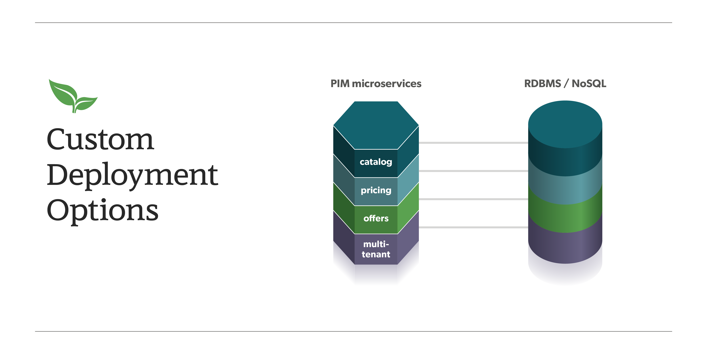

:blc_ms_version: 0.11.0-RC1
:toc:
:icons: font
:source-highlighter: prettify
:project_id: ms-starter
:sectnums:
ifdef::env-github[]
:tip-caption: :bulb:
:note-caption: :information_source:
:important-caption: :heavy_exclamation_mark:
:caution-caption: :fire:
:warning-caption: :warning:
endif::[]

= Getting Started with Broadleaf Microservices

This project provides a reference of how Broadleaf core libraries can help accelerate your
microservice-based application development and is intended to give you a hands on look at core 
Broadleaf concepts and extension patterns.  

== Project Goals
The guides and tutorials in this project will walk you through:

- getting the core commerce framework services running locally
- running a reference implementation of Broadleaf's unified microservices admin which can manage 
data across the various microservices
- running a reference implementation of a consumer-facing storefront application
- concepts around extending and customizing the framework       

== What Do I Need?
In order to get this reference project running locally, you will want to obtain and install 
the following:

=== Credentials
Access to Broadleaf's Docker Registry and Maven Nexus is needed in order to pull down the 
appropriate resources.

Once you have obtained these credentials, you will need to configure them for the dependencies
below.

[NOTE]
====
Contact `info@broadleafcommerce.com` for information on how to receive these credentials
====

=== Java
You will need https://www.oracle.com/java/technologies/javase-downloads.html[JDK 1.8] or later
installed on your machine.  

=== Docker
You will need to have https://docs.docker.com/install/[Docker Engine & Docker Compose] installed
locally

[TIP]
====
Docker Desktop for both Mac and Windows already includes compose along with other
docker apps.
====

Once you have docker installed, you will want to authenticate with Broadleaf's docker registry.

Type the following into your CLI:

[source,shell script]
----
docker login repository.broadleafcommerce.com:5001
----

When prompted, type in the username and password you received above.

=== Maven
You'll need to have Maven installed locally as well. 
https://maven.apache.org/download.cgi[Maven 3.5 or later] is recommended.

Once you have maven installed, add the following to your `~/.m2/settings.xml` making sure to 
replace the credentials with the ones you received above:

[source,xml]
----
<server>
    <id>broadleaf-microservices</id>
    <username>username_here</username>
    <password>password_here</password>
</server>
----

[TIP]
====
More info about authenticating with private repositories can be found
https://maven.apache.org/settings.html#Servers[here]
====

=== Running the Project

Now that all of the pre-requisites are installed, let's run the project!

1. First, let's build the project using Maven
+
[source,shell script]
----
mvn clean install
----
+
2. Before you start up all the APIs, you'll need to first start up a few supporting services
that are required for this example. These services are provided via docker images and can be run
and started from the command line by navigating to the root of this project and running:
+
[source,shell script]
----
docker-compose up -d
----
+
//TODO - example docker dashboard image nice to have
+
3. Next, you will want to start up the core backend commerce APIs by running the following command:
+
[source,shell script]
----
mvn spring-boot:run -Dspring-boot.run.jvmArguments="-DzkACLProvider=org.apache.solr.common.cloud.VMParamsAllAndReadonlyDigestZkACLProvider -DzkCredentialsProvider=org.apache.solr.common.cloud.VMParamsSingleSetCredentialsDigestZkCredentialsProvider -DzkDigestUsername=readonly-user -DzkDigestPassword=CHANGEME-READONLY-PASSWORD"
----
+
4. That's it! Once you've verified that the supporting services and backend APIs are running, you can visit
the administration console and the consumer storefront from a browser:
+
- Admin Console: https://localhost:8446/?site=global
  - Username: `master@test.com`
  - Password: `Pass1word!`
- Storefront: https://localhost:8456/?site=heatclinic.com  

=== Testing Endpoints Directly

During local development or evaluation, you may find it beneficial to hit the API
endpoints directly either via `cURL` or utilizing a tool like https://www.postman.com/[POSTMAN].
In this case, you can disable security when starting up the backend services using the
following command (instead of the command outlined in step 2 above) so that you don't have to 
worry about getting a valid JWT authentication token every time:

[source,shell script]
----
mvn spring-boot:run -Dspring-boot.run.jvmArguments="-Dbroadleaf.resource.security.oauth2.defaultAllowAllAnonymous=true -Dbroadleaf.common.policy.validation.enforce=false -DzkACLProvider=org.apache.solr.common.cloud.VMParamsAllAndReadonlyDigestZkACLProvider -DzkCredentialsProvider=org.apache.solr.common.cloud.VMParamsSingleSetCredentialsDigestZkCredentialsProvider -DzkDigestUsername=readonly-user -DzkDigestPassword=CHANGEME-READONLY-PASSWORD"
----

Once you have the services running, you should be able to issue a request like:

//TODO Insert Example cURL to an endpoint here 

== Project Structure Overview

This project is structured in a manner that is meant to easily demonstrate various
features and aspects of the framework and does not necessarily reflect how you may want to structure
your real implementation project. 

Specifically, the structure intends to demonstrate the framework's flexible composition model - you 
have the ability to selectively compose multiple services into a single deployment or deploy them 
independently.

[NOTE]
====
This particular project demonstrates the ability to compose a majority of the core
backend commerce services together into a single deployable spring boot application.
====

=== Important Pieces
The following are the main components of this project and should be noted:

1. `docker-compose.yml` - this is the main entrypoint for utilizing the project. 
This defines some supporting services that are required to run the full scope of these examples.
See this FAQ: "<<faq-supporting-services>>" to get a description about each of these images
2. `pom.xml` - this defines the core commerce library dependencies that will be utilized 
for this guide (e.g. catalog, pricing, offers, etc...)
3. `src/main/resources/application-default.yml` - this file configures a few default local 
property configurations for the backend commerce services including database configuration and
initialization parameters

== What's Next?
Now that you have the project running and have a high level understanding of how to build
and use it, the next step would be to walk through some typical customizations. See the following
for more details:

- link:tutorials/README.adoc[Customization & Extension Guide]

== FAQ

[[faq-where-data-stored]]
=== Where is the data for these services stored?

- One of the supporting services defined in this project is a Postgres DB. 
For this project, each individual service is configured to point to the same Postgres instance 
with a unique schema. The default schemas that correspond to each service can be found in 
`application-default.yml`

[[faq-where-data-go]]
=== Why did my data get wiped after a restart of the services?

- By default, the project is configured to drop all tables and re-run import scripts on startup 
in the `default` runtime environment. You can find the following type of property config in 
`application-default.yml`

[source,yaml]
----
broadleaf:
  service_abc:
    jpa:
      hibernate:
        ddl-auto: create
----

[[faq-where-data-from]]
=== Where did all this initial data come from?

- All of the Broadleaf services come with a set of default demo data. The seed data scripts are 
contained within each of the individual services dependency `.jar` and are loaded via a property
configured in `application-default.yml`

[[faq-supporting-services]]
=== What is the purpose for all of these supporting docker services?

- the `docker-compose` file defines various services that aid in facilitating a full commerce 
experience needed for this overview project and tutorial, such as an `authentication` service and 
a couple API gateways. A majority of these images should be considered for reference purposes only
and **NOT FOR PRODUCTION USE**. The following is a list of all the supporting services with a brief
description of their purpose.
  - `admingateway` - this is a lightweight API Gateway built on top of 
  https://spring.io/projects/spring-cloud-gateway[Spring Cloud Gateway] to facilitate routing
  for the admin console
  - `adminuser` - this is a small service that holds a set of
  demo admin user data with different roles and permissions
  - `adminweb` - this is a reference image of our React Microservices Admin SPA 
  - `auth` - this is a lightweight OAuth2 authorization server used to generate the necessary JWT 
  tokens for authentication
  - `commercegateway` - this is a lightweight API Gateway built on top of 
  https://spring.io/projects/spring-cloud-gateway[Spring Cloud Gateway] to facilitate routing
  for the admin console
  - `commerceweb` - this is a reference image of our React Commerce Storefront SPA
  - `config` - this is a lightweight config server built on top of 
  https://cloud.spring.io/spring-cloud-config/reference/html/[Spring Cloud Config] to support
  externalized configuration cross-services  
  - `localkafka` - Official Confluent https://hub.docker.com/r/confluentinc/cp-kafka[Docker Image]
  for Kafka (Community Version) 
  - `localsolr` - Broadleaf-flavored image based on Solr's official 8.2 distro
  - `postgres` - Official Postgres 11.2 https://hub.docker.com/_/postgres[Docker Image]
  - `zk` - Official Confluent https://hub.docker.com/r/confluentinc/cp-zookeeper[Docker Image]
  for Zookeeper
  